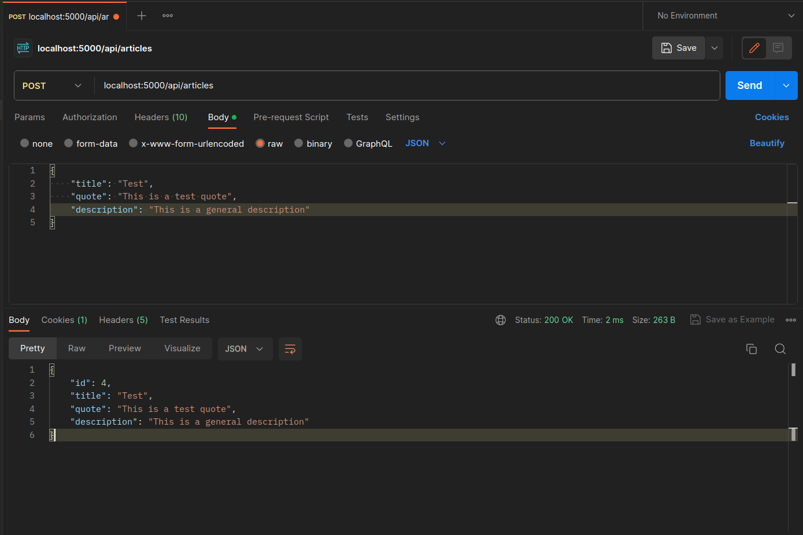

# Aplicación realizada para Lenguajes Interpretados en el Servidor C2 - 23 🚀

## Pasos para correr la presente aplicación

- Correr: `git clone https://github.com/montanx/lis-node-app.git`
- Abrir la consola de dicho proyecto y ejecutar: `npm install`
- Abrir un navegador de preferencia o incluso Postman, dirigirse a la ruta `localhost:5000/api/articles`, donde encontrara articulos creados.

## ¿Como funciona?

Para dicho proyecto, hemos decidido obviar el uso de express (lo cual pudo haber hecho nuestra app más limpia y deploy-ready), dadas las indicaciones. Hemos creado mocks de data el cual nos permitiria simular una base de datos. De esta forma, hemos añadido tambien rutas para realizar un CRUD completo de articulos, esto con las rutas:

- `{{URL}}/api/articles` (obtiene todos los articulos) - Ruta tipo GET
- `{{URL}}/api/articles/:id` (obtiene el articulo con el **id** correspondiente) - Ruta tipo GET
- `{{URL}}/api/articles` (crea un articulo, requiere de un body que contenga la siguiente estructura: {title: STRING, quote: STRING, description: STRING}) - Ruta tipo POST.

- `{{URL}}/api/articles/:id` borra el articulo seleccionado. - Ruta tipo DELETE
- `{{URL}}/api/articles/:id` edita el titulo del articulo seleccionado. - Ruta tipo UPDATE/PATCH
